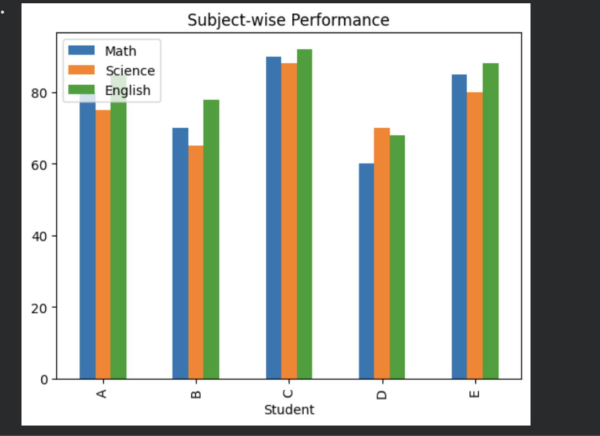

# Student Performance Analysis & Visualization

##  Overview
This project analyzes student performance across subjects using Python and visualizations.

## Key Insights
- Identified top-performing student based on average marks
- Compared subject-wise performance
- Highlighted strengths and weaknesses using charts

##  Tools Used
- Python (Pandas)
- Matplotlib
- Google Colab

## Files
- student_performance_analysis.ipynb → analysis notebook

## Visualization

## Conclusion
This project demonstrates how data analysis can help evaluate academic performance effectively.
